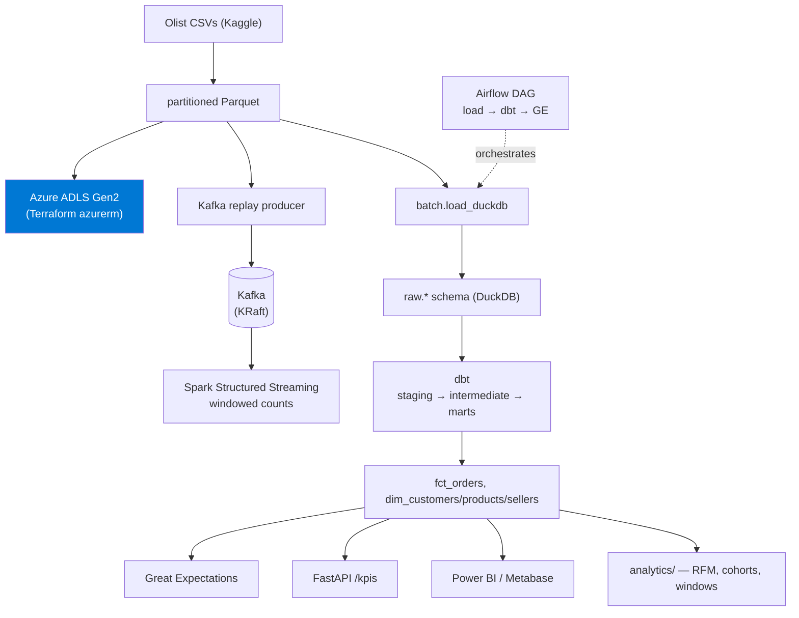

# Olist E-Commerce Analytics Platform

End-to-end analytics platform on the public **Brazilian Olist** e-commerce dataset (~100k orders, 9 relational tables). Built as a portfolio piece covering the modern data stack a Data Analyst / Analytics Engineer job description asks for.

## Stack & keyword index

| Layer            | Tech                                                                                         |
| ---------------- | -------------------------------------------------------------------------------------------- |
| Object storage   | **Azure Data Lake Storage Gen2** (provisioned via **Terraform** `azurerm`), partitioned Parquet |
| Streaming        | **Apache Kafka**, **Spark Structured Streaming** (`confluent-kafka` producer)                |
| Batch ingestion  | Python + **azure-storage-file-datalake** + **pyarrow**                                       |
| Warehouse        | **DuckDB** (local), **Snowflake**-ready (swap dbt profile)                                   |
| Transformations  | **dbt** — staging → intermediate → marts                                                     |
| Data quality     | **Great Expectations** + dbt tests                                                           |
| Orchestration    | **Apache Airflow** (LocalExecutor, Docker)                                                   |
| Serving          | **FastAPI** metrics API                                                                      |
| BI / dashboard   | **Power BI** (.pbix on DuckDB ODBC) + Metabase fallback                                      |
| CI/CD            | **GitHub Actions** — ruff, sqlfluff, pytest, dbt build, GE, Docker → GHCR                    |
| Containerization | **Docker** + Docker Compose                                                                  |

## Architecture



## Repository layout

```
ingestion/      # Olist CSV → parquet → ADLS Gen2, plus the Kafka replay producer
streaming/      # Spark Structured Streaming consumer
batch/          # Parquet → DuckDB raw-zone loader
warehouse/      # dbt project (models, tests) + profiles + sqlfluff config
orchestration/  # Airflow DAG (load → dbt → GE)
quality/        # Great Expectations validation
api/            # FastAPI metrics endpoints
analytics/      # Standalone showcase SQL (window fns, cohorts, RFM)
dashboard/      # Power BI connection (.pbids), Power Query, DAX measures, theme
infra/          # Terraform for ADLS Gen2 + RBAC
docker/         # Kafka + Airflow compose stacks
tests/          # pytest suite + synthetic fixture
.github/        # CI/CD workflows
```

## Roadmap

- [x] **M0** Wipe + baseline scaffolding
- [x] **M1** Olist → parquet → ADLS Gen2, Terraform `azurerm` module
- [x] **M2** DuckDB warehouse + dbt models + tests
- [x] **M3** Kafka replay producer + Spark streaming consumer
- [x] **M4** Airflow DAG + Great Expectations
- [x] **M5** FastAPI + Power BI dashboard
- [x] **M6** GitHub Actions CI/CD
- [x] **M7** Polish, screenshots, writeup

See [`CLAUDE.md`](CLAUDE.md) for agent / contributor guidance.

## Key results

Numbers from the full ~100k-order dataset (served live by the [API](api) and the
[analytics queries](analytics)):

| Metric | Value |
| --- | --- |
| Orders / revenue | 99,441 orders · **R$15.8M** |
| Avg order value | R$159 |
| Avg review score | **4.09 / 5** |
| Avg delivery time | 12.5 days (8.1% later than estimated) |
| Top state | São Paulo — 42% of orders |
| Top category | health & beauty |
| Repeat-purchase rate | **~1.05 orders/customer** — a one-time-buyer marketplace |

That last point is the analytical headline: with retention near zero
([cohort_retention.sql](analytics/cohort_retention.sql)), the levers are
acquisition and first-order experience — which is what `fct_orders` measures.

## Quickstart

```powershell
python -m venv .venv ; .venv\Scripts\Activate.ps1        # Windows
pip install -r requirements.txt                          # see note on Airflow below
Copy-Item .env.example .env                              # fill in Azure (+ optional Kaggle)
```

> **Airflow** is not installed locally — it doesn't support native Windows and
> runs in Docker (see M4). On a dev box, skip it:
> `pip install (Get-Content requirements.txt | Select-String -NotMatch '^apache-airflow')`.
> **Spark** (M3) needs a JDK 17 with `JAVA_HOME` set.

### Run it, milestone by milestone

```powershell
# M1 — provision ADLS + land raw parquet
cd infra/terraform ; terraform init ; terraform apply ; cd ../..
python -m ingestion.olist_to_parquet     # CSV → partitioned parquet
python -m ingestion.upload_to_adls       # → abfss://raw@...

# M2 — warehouse + transforms
python -m batch.load_duckdb              # parquet → DuckDB raw.*
cd warehouse ; dbt build --profiles-dir . ; cd ..   # staging → marts (+ 35 tests)

# M3 — streaming (Docker + JDK 17)
docker compose -f docker/docker-compose.yml up -d
python -m streaming.spark_consumer       # consumer (windowed counts)
python -m ingestion.kafka_replay         # producer (replay orders)

# M4 — orchestration + data quality (Docker)
python -m quality.validate               # GE suites over raw.* (standalone)
docker compose -f docker/airflow/docker-compose.yml up airflow-init
docker compose -f docker/airflow/docker-compose.yml up -d   # UI :8080

# M5 — serving
uvicorn api.main:app --port 8000         # KPIs at :8000/docs
#   Power BI: open dashboard/connection.pbids (see dashboard/README.md)

# M6 — checks
pytest                                   # loader → dbt → GE → API on a fixture
ruff check . ; (cd warehouse ; sqlfluff lint models/)

# Analytics showcase
duckdb warehouse/olist.duckdb -c ".read analytics/rfm.sql"
```

## Testing & CI

- **`pytest`** spins up the *real* pipeline (loader → `dbt build` → Great
  Expectations → FastAPI) against a tiny [synthetic fixture](tests/sample_data.py),
  so CI needs no proprietary data.
- **[GitHub Actions](.github/workflows/ci.yml)** runs four jobs on every PR:
  `ruff`, `sqlfluff` (dbt templater), `pytest`, and a Docker build that pushes the
  API image to **GHCR** on `main`.

## Screenshots

See [`docs/screenshots/`](docs/screenshots) for the dashboard, Airflow graph,
API docs, and CI captures.
