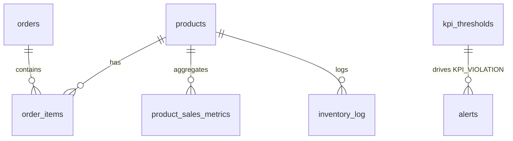

# Architecture

## System diagram

```mermaid
flowchart LR
    subgraph Generator["Order Generator (Python)"]
        GEN[order_producer.py\nFaker + weighted popularity\nburst injection]
    end

    subgraph Broker["Apache Kafka"]
        TOP1[(topic: orders)]
        TOP2[(topic: inventory-updates)]
    end

    subgraph Stream["Spark Structured Streaming"]
        READ[readStream.kafka] --> PARSE[from_json + watermark]
        PARSE --> AGG1[1-min tumbling\nrevenue agg]
        PARSE --> AGG2[1-min tumbling\nper-product agg]
        PARSE --> INV[inventory decrement\n+ low-stock check]
        AGG1 --> FB[foreachBatch sink]
        AGG2 --> FB
        INV --> FB
    end

    subgraph DB[(MySQL 8)]
        ORD[orders / order_items]
        SM[sales_metrics]
        PSM[product_sales_metrics]
        PRD[products]
        INVLOG[inventory_log]
        ALERTS[alerts]
        KPI[kpi_thresholds]
    end

    subgraph Services["Detection services (Python)"]
        ANO[anomaly/detector.py\nz-score + IsolationForest]
        KPIEV[kpi/evaluator.py\nthreshold-driven]
    end

    BI[Power BI Desktop\nDirectQuery, 1-min refresh]

    GEN --> TOP1
    TOP1 --> READ
    FB --> ORD
    FB --> SM
    FB --> PSM
    FB --> PRD
    FB --> INVLOG
    FB --> ALERTS
    SM --> ANO
    ANO --> ALERTS
    SM --> KPIEV
    PRD --> KPIEV
    KPI --> KPIEV
    KPIEV --> ALERTS
    DB --> BI
```

## Component responsibilities

| Component | Role | Runtime |
|---|---|---|
| **order_producer.py** | Generate realistic orders + bursts | Python process |
| **Kafka / Zookeeper** | Durable, replayable event bus | Docker |
| **stream_processor.py** | Parse, window, aggregate, upsert, decrement inventory, emit low-stock alerts | Spark driver |
| **detector.py** | Revenue-spike anomaly detection | Python process |
| **evaluator.py** | SLO checks driven by `kpi_thresholds` rows | Python process |
| **MySQL** | Source of truth for facts, aggregates, alerts | Docker |
| **Power BI** | Presentation layer (4 pages) | Desktop, DirectQuery |

## Data flow

1. Generator emits one order every 2-5s (JSON, keyed by `order_id`).
   Every `BURST_EVERY_SECONDS` it emits a 10-15s burst of 30-60 orders
   to exercise the anomaly path.
2. Spark consumes the `orders` topic with a 10-minute watermark,
   giving late-arriving events a chance to join the correct window.
3. Inside `foreachBatch`:
   - Raw orders → `orders` (append).
   - Exploded line items → `order_items` (append).
   - 1-min revenue aggregate → `sales_metrics` via `_stg_*` staging
     table and `ON DUPLICATE KEY UPDATE` for idempotency.
   - 1-min per-product aggregate → `product_sales_metrics`.
   - `products.stock_quantity` decremented and `inventory_log` insert.
   - New `LOW_STOCK` alert rows inserted where `stock <= threshold`
     (10-minute dedupe guard).
4. `detector.py` polls `sales_metrics` every 60s. With <15 data points
   it falls back to z-score (σ > 3); otherwise it fits an Isolation
   Forest on revenue + order_count and flags outliers only on the
   high side of the median. Hits become `REVENUE_SPIKE` alerts.
5. `evaluator.py` polls `kpi_thresholds`, computes each metric
   against its configured window, compares to warning/critical, and
   writes `KPI_VIOLATION` alerts. Thresholds can be edited in SQL at
   runtime.
6. Power BI hits MySQL directly. Page refresh of 1 minute is enough
   because aggregates are already pre-computed in `sales_metrics`.

## Schema relationships



## Key design calls

- **Kafka instead of files/sockets** — replayable and multi-consumer;
  the anomaly detector could also read the stream directly if needed.
- **`foreachBatch` over `foreachSink`** — lets us write to multiple
  destinations atomically and run non-JDBC logic (raw SQL for the
  upsert, connector call for inventory).
- **Staging-table upsert** — Spark JDBC can only `INSERT`; the
  `_stg_*` pattern gives idempotent merges with `ON DUPLICATE KEY`.
- **10-minute watermark** — balances late-order tolerance against
  state retention; with minute windows it's ≈10 windows of state.
- **Two-stage anomaly** — z-score bootstraps before IF has data; IF
  kicks in once we have enough history. Both ignore low-side spikes
  (those are handled by the KPI evaluator's `revenue_drop_pct`).
- **Thresholds in SQL** — treat SLO tuning as analytics config, not
  code deploys.

## Observability

- Each worker logs to `./logs/<name>.log` via `orchestrator.py`.
- Kafka UI at http://localhost:8080 shows topic offsets and consumer
  lag for Spark.
- The `alerts` table is itself the operational feed — every
  anomaly, LOW_STOCK, and KPI_VIOLATION is a row with severity and
  detected_value for post-mortem.
